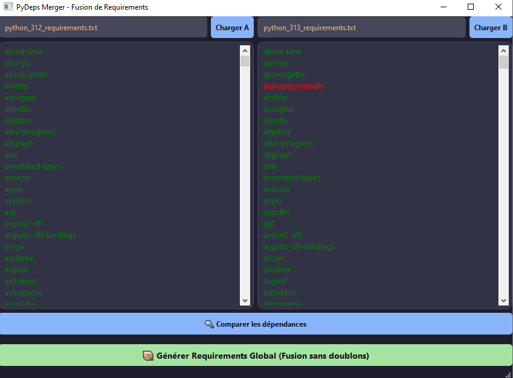

# Pip Requirements Merger 🐍



**Pip Requirements Merger** est un utilitaire graphique conçu pour simplifier la gestion des dépendances Python lors de migrations de versions ou de consolidations de projets. Il permet de fusionner plusieurs fichiers `requirements.txt` (ex: issus de Python 3.9, 3.10 et 3.13) en un seul fichier unique, propre et sans doublons.

## 🌟 Pourquoi cet outil ?

Lors du passage d'une version de Python à une autre, l'exécution de `pip freeze` génère souvent des fichiers de dépendances légèrement différents selon l'environnement. Cet outil automatise le nettoyage :
* **Migration simplifiée** : Fusionne les exports de différentes versions de Python pour préparer un environnement 3.13 propre.
* **Élimination des doublons** : Utilise la puissance des `sets` Python pour garantir qu'aucune librairie n'apparaît deux fois.
* **Normalisation automatique** : Supprime les espaces inutiles, les lignes vides et les erreurs de formatage.

## ✨ Fonctionnalités

- 🛠 **Fusion Intelligente** : Analyse et regroupe les packages de plusieurs fichiers source.
- 📉 **Nettoyage de Données** : Normalise le texte pour éviter les erreurs lors du prochain `pip install`.
- 📁 **Interface Intuitive** : Une interface moderne en **PyQt6** avec sélection de fichiers via l'explorateur natif.
- 🚀 **Export Rapide** : Génère un nouveau fichier `requirements_merged.txt` prêt à l'emploi.

## 🛠 Installation et Utilisation

### Prérequis
- Python 3.x
- PyQt6

### Lancement
1. Installez la dépendance graphique :
   ```bash
   pip install PyQt6

2. Lancez l'application :
   ```bash
   python main.py